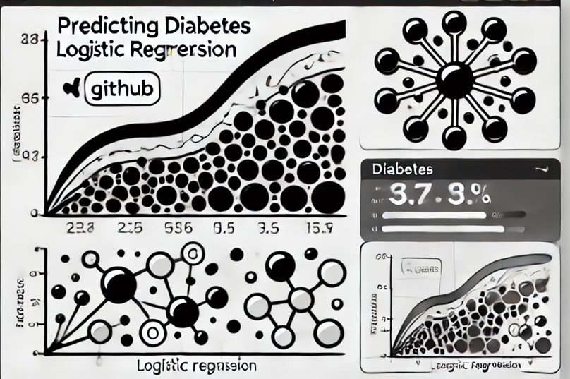
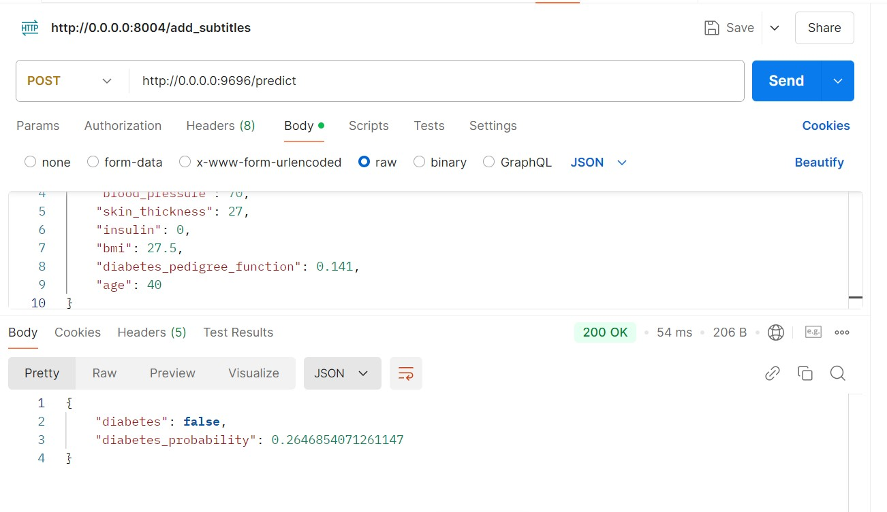

# **Diabetes Prediction Using Machine Learning**



This repository contains the mid-term project for the ML Zoomcamp program. The goal of this project is to develop and deploy a machine learning model to diagnostically predict whether a patient has diabetes based on the **Pima Indians Diabetes Database**.

---

## **Problem Description**

### Objective
Diabetes is a chronic condition that affects millions worldwide. Early diagnosis is crucial for effective management and treatment. The objective of this project is to build a machine learning model that can predict whether a patient has diabetes based on specific medical attributes.

### Dataset
The project uses the **Pima Indians Diabetes Database**, which contains the following attributes:
- Number of pregnancies
- Glucose concentration
- Blood pressure (mm Hg)
- Skin thickness (mm)
- Insulin level (μU/mL)
- Body mass index (BMI)
- Diabetes pedigree function
- Age (years)
- Target variable: `Outcome` (1 if the patient has diabetes, 0 otherwise)

The dataset aims to provide diagnostic results for diabetes based on these features.

---

## **Project Structure**

The repository contains the following files:

- **`README.md`**: This file, describing the project and how to run it.
- **`diabetes.ipynb`**: data cleaning and model selection process.
- **`diabetes.py`**: exported script from .ipynb.
- **`train.py`**: A Python script for training the machine learning model and saving it to a file.
- **`predict.py`**: A script for loading the trained model and serving predictions via a web service.
- **`requirements.txt`**: Lists all Python dependencies needed for the project.
- **`Dockerfile`**: Configuration for building a Docker image to run the service.
- **`participant.json`**: Exemple of input data for deployed service
- **`model_C=10.bin`**: logistic regression model binary file with (solver='liblinear', C=10, max_iter=1000, random_state=42)
- **`postman_screenshot.jpg`**: Demonstrates the interaction with the deployed service using Postman.

---

## **How to Run the Project**

### Prerequisites
- Docker (for containerized deployment)

### Setup Instructions

1. **Clone the repository**:
   ```bash
   git clone https://github.com/abarlukova/Predictor_diabetes.git
   ```

2. **Download the dataset**:
   - Dataset is available at [Kaggle: Pima Indians Diabetes Database](https://www.kaggle.com/uciml/pima-indians-diabetes-database).
   - Place create `data/` directory and put dataset `diabetes.csv` inside.

3. **Deploy with Docker**:
   Build and run the Docker container:
   ```bash
   docker build -t diabetes-prediction .
   docker run -it --rm -p 9696:9696 diabetes-prediction
   ```

4. **Access the Application**:
   The application will be accessible at `http://localhost:9696`.

5. **Test the Deployment**:
   - Use the provided `participant.json` file, which contains sample input data:
     ```json
     {
         "pregnancies": 10,
         "glucose": 111,
         "blood_pressure": 70,
         "skin_thickness": 27,
         "insulin": 0,
         "bmi": 27.5,
         "diabetes_pedigree_function": 0.141,
         "age": 40
     }
     ```
     Send a POST request to the application endpoint.
---

## **Deliverables**

1. **EDA and Model Development (`diabetes.ipynb`)**:
   - Data preparation and cleaning steps.
   - Exploratory Data Analysis (EDA), including feature importance analysis.

      Result :  `Glucose`, `Body Mass Index`, `Age`, and `Pregnancies` are the most important features.
   - Model selection between Logistic regression, Random forest and XGBoost and parameter tuning based on AUC measure.
      - **LR** : `0.86`, 
      - **RF** : `0.83`, 
      - **XGBoost** : `0.82`

      on validation set.

   Logistic regression at `C=10` showed the best performance. So, I selected logistic regression for deployment.

2. **Training Script (`train.py`)**:
   - Trains the final model and saves it as a pickle file.

3. **Prediction Script (`predict.py`)**:
   - Loads the trained model and serves predictions via a REST API.

4. **Docker Deployment**:
   - The service can be containerized using the provided `Dockerfile`.

5. **Dataset Instructions**:
   - Instructions for downloading the dataset and placing it in the `data/` folder.

6. **Test**:
   You can test API using data in participant.json
   
8. **Demonstration**:
   Test API with Postman
   
   
   

---

## **Key Features**

- **Machine Learning Model**: Logistic Regression as the baseline model, with performance compared to other algorithms such as Random Forest and XGBoost.
- **REST API**: A lightweight web service to make predictions based on input data.
- **Dockerized Deployment**: Ensures compatibility and easy deployment across environments.

---

## **Acknowledgments**

- **ML Zoomcamp**: This project was created as part of the ML Zoomcamp mid-term assignment.
- **Dataset**: The Pima Indians Diabetes Database, sourced from Kaggle.

Feel free to explore the code and suggest improvements! 😊
